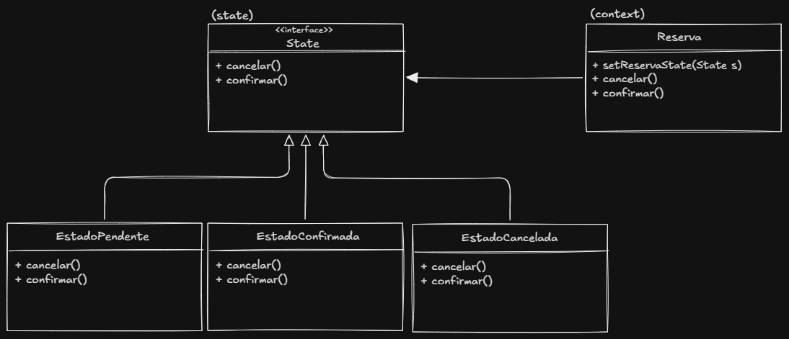

# Padrão State — Descrição e implementação no projeto

## Por que foi adicionado
Anteriormente o estado da reserva era armazenado como uma string na própria classe `Reserva`. Para tornar o estado mais dinâmico, encapsulado e extensível, o projeto adotou o padrão State: cada estado passa a ser representado por uma classe que implementa o comportamento da reserva naquele estado.

## Como funciona o padrão State
O padrão State delega o comportamento dependente do estado para objetos separados chamados estados. Em vez de a classe contexto (aqui, `Reserva`) decidir o que fazer com base em um valor primitivo (string), ela mantém uma referência a um objeto `State` e delega a execução das operações para esse objeto. Cada subclasse de `State` implementa as ações e transições possíveis no seu contexto.

## Implementação neste projeto

- Arquivos principais:
	- `src/reservas.py` — contém a classe `Reserva` que atua como contexto.
	- `src/states.py` — contém a classe abstrata `State` e as implementações concretas: `EstadoPendente`, `EstadoConfirmada` e `EstadoCancelada`.

- Estrutura de classes:
	- `State` (abstrata): define a interface comum (`cancelar`, `confirmar`) e mantém referência à `reserva` quando associada.
	- `EstadoPendente`, `EstadoConfirmada`, `EstadoCancelada`: implementam as operações específicas e, quando apropriado, realizam transições usando `reserva.setReservaState(...)`.

- `Reserva` (contexto):
	- Mantém `self.state`, que é um objeto derivado de `State`.
	- Fornece `setReservaState(novo_estado)` para trocar o estado e ligar `state.reserva = self`.
	- Métodos como `cancelar()` e `confirmar()` delegam diretamente para `self.state.cancelar()` e `self.state.confirmar()`, e então chamam `notificar(...)` para informar observers sobre a mudança.

## Class diagram
